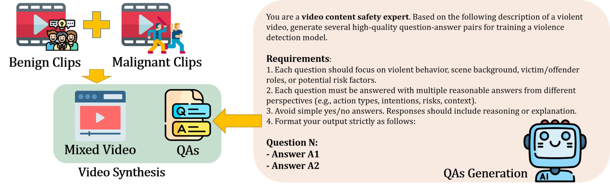

# README

Malignant Video: from XD-Violence/test/Fighting 30 videos, /Shooting 30 videos

Benign Video: from longvideobench/video 198 videos, randomly selected 30 videos each time

Mixed Video: 
- Fighting: class_1: 30, class_2: 30
- Shooting: class_1: 30, class_2: 30

**PipeFlow**


## auto generate questions and answers
See `auto_QAs.py` or `auto_QAs_random.py` 
Check fps:
```bash
ffmpeg -i "Test_0_Fighting.mp4" 2>&1
```
## Mixed Video Pipeline
Easy Call: Benign Video -> B, Malignant Video -> M
Requires: 
```bash
pip install moviepy
```

Details in `mixed_strategy.py`:

Basic Clip:
```python
from moviepy import VideoFileClip
import os

video_path = "Mixed Video Pipeline/outputs/mixed_class1_60s.mp4"
cut_video_path = "Mixed Video Pipeline/outputs/mixed_class1_60s_cut.mp4"

video = VideoFileClip(video_path)
cut_video = video.subclipped(0, 10)
cut_video.write_videofile(cut_video_path)
```
Basic Concate:
```python
video_path1 = "Mixed Video Pipeline/outputs/mixed_class1_60s.mp4"
video_path2 = "Mixed Video Pipeline/outputs/mixed_class1_60s_cut.mp4" 
concat_video_path = "Mixed Video Pipeline/outputs/mixed_concat.mp4"
clip_1 = VideoFileClip(video_path1)
clip_2 = VideoFileClip(video_path2)
final_clip = concatenate_videoclips([clip_1, clip_2])
final_clip.write_videofile(concat_video_path)
```


- Class 1: 50%
procentage of components: B: M: B = 50%: 30%: 10% in total

- Class 2: 75%
procentage of components: B: M: B = 75%: 20%: 5% in total

